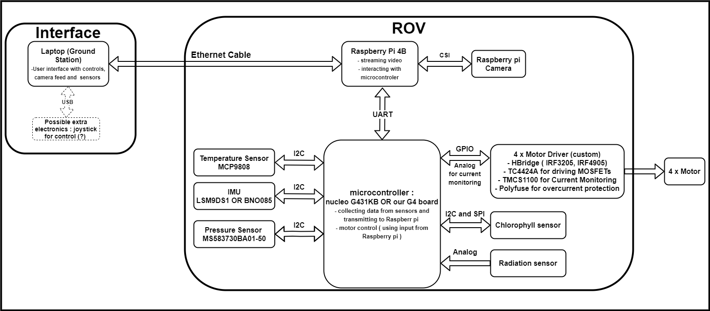
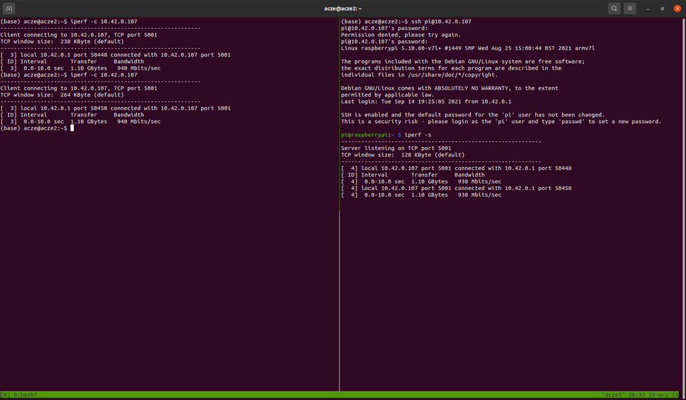

# ROV-project

## Description 
This repository contains the software, hardware and 3D design for the ROV project.

## Project introduction and motivation
Goal is to create Remotely Operated Vehicle for underwater environments. ROV should :
- should operate safely in underwater environment up to reasonably low water depth ( construction should be waterproof, designed in mind to deal with the possibility of flooding)
- be able to be controlled by the User on ground station ( using something like GUI or physical devices like joystick/xbox controller etc. )
- provide useful data from sensors to User ( video feedback, attitude ( orientation ), other somehow relevant sensors )
- design should be flexible for possible modification in future 

## Diagram 
Whole system of the ROV is presented on the image below :

## Mechanical Design 
### Design

whole mechanical design is done by mechanical team of ROV team  
### Waterproofing

### Components Description 
#### Ground Station
- Main device with which User will interact will be laptop ( or other device to which we can connect Ethernet cable and will provide easy interaction ). Using laptop/other workstation provides few benefits : 
    - Most of the "heavy stuff" will be done on the workstation that we can control and only necessary software will run in the actual ROV 
    - makes the system very flexible : lots of possible expansion in the future ( fancy control like joysticks ? We can create own device and plug to USB or add support for xbox controller. Some computer vision algorithms for the camera ? the workstation can have GPU on it, we can provide quite a lot of computation power ( rather than relying on raspberry pi or other single board computer ))

#### Communication
- Ethernet should allow fast ( Raspberry pi has 1Gbit Ethernet port ), reliable and long distance communication ( and works underwater since it's just a cable ). We can also use Ethernet to power the device ( "Power over Ethernet") 
-  All other communication within ROV uses standard and popular data transmission protocols 
-  According to David, possiblity of extension to wireless 

Raspberry pi connected to laptop over 20 meter ethernet cable. Currently just streams video ( 1080p) over MQTT, bandwidth test below : 

### Single Board Computer ( Raspberry Pi 4b)
- Extremely popular platform with support for good quality, real time video streaming and interacting with hardware ( using Serial communication ). Great community support and very fast to learn ( also Computer Science departament uses it in teaching )
- Can be programmed in few languages ( C, C++, python, probably others ), although python is used for the fast and easy development ( limitations of python like GIL can be removed by using multiprocessing etc.). 

### Microcontroller ( STM32G4)
- Microcontroller from new G4 line from STMicroelectronics. Not popular line, not "battle-tested" but cheap, high-performance microcontroller with lots of peripherals and can be programmed in Mbed Environment or HAL. Although there are popular choices ( pico's, arduino atmega's, ESP32's other stm's) it can be great opportunity to learn new platform that seems to be targeted for more industrial applications ( and overall learn something new and fun). Other than that, it has lots of features per pound ( 3.5 pound before chip shortage). The design doesn't realy that much on the microcontroller ( it requires few good timers, I2C, UART, SPI, reasonable ADC, most of the microcontrollers provide that)  so we can change to other platform if the chosen microcontroller won't prove it's worth. 

Current microcontroller board : 

  
Render of the final board that will go hopefully in the final design

### Motors
- Lots of possible choices ( We orderd the dual shaft ,mabuchi like(DC motor),~30W from robotshop). Custom driver created for the motors using Hbridge circuit. Main drawback is that we need to solder/design/debug it but advantage is that it provides quite a bit of extra features that we included in our design : overcurrent protection ( using polyfuse ), high amperage and reasonably low power losses ( dependent on mosfets ), protection of Microcontroller pins ( using Mosfet driver to drive large mosfets from Hbridge) and current monitoring ( output voltage of TMCS1100 sensor is proportional to the current that flows through the mosfets). All of the features could possibly help us debugging, monitoring and hopefully help with safety when dealing with large motors.
-  Possibility of adding encoders in the future 

Current Motor driver :  

### Sensors 
- Other than driving platform we wanted to provide range of measurements:
  -  Temperature sensor is standard. 
  -  Pressure sensor is not popular sensor, designed specifically for underwater environment ( up to 300m ) which provides high resolution ( and it's low cost compared to other underwater sensors ). 
  -  MARG sensor ( accelerometer, gyroscope, magnetometer). Using the data we can use AHRS algorithm ( experimented with Madgwick Filter which will be probably used in the design) we can visualize the orientation of the ROV on display on the laptop / ground station [Madgwick Report](https://www.x-io.co.uk/res/doc/madgwick_internal_report.pdf).
  -  Chlorophyll sensor. Custom sensor using the fluorescence measurement that should allow us to estimate the chlorophyll concentration. Chlorophyll concentration helps scientists to estimate health of the lake/other water containers [TODO point to document with more details].
  -  Radiation sensor : was in the first design because of initial project idea from Sellafield. Seems like challenging project and cool expansion to the project. Initial design created from the Elektor magazine article about Radiation detection. General reference used for it was "Radiation detection and measurement" and [opengeiger](http://www.opengeiger.de/index_en.html) website

Sensors :  
Chlorophyll sensor :  

Pressure Sensor :  

